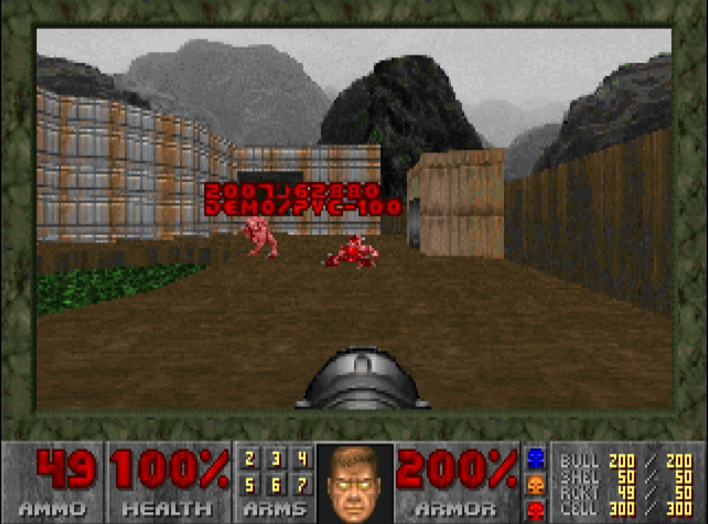

# Kube DOOM
## Kill Kubernetes pvcs using Id's Doom!

The next level of chaos engineering is here! Kill pvcs, pods or namespaces inside your Kubernetes
cluster by shooting them in Doom!

This code is built as an extension of [storax/kubedoom](https://github.com/storax/kubedoom) which in turn 
is a fork of the excellent [gideonred/dockerdoomd](https://github.com/gideonred/dockerdoomd) using a
slightly modified Doom, which was forked from psdoom.




### Building kubedoom container image
```console
git clone git@github.com:gregnsk/kubedoom.git
cd kubedoom
podman build -t pvckubedoom:0.1.0 .
```

#### You may need to configure podman to use an insecure registry:
a. Edit or create the registries.conf file which is usually located at /etc/containers/registries.conf.
b. Add your registry to the [registries.insecure] block. If this block doesn't exist, create it. Here's an example of what you might add:
[registries.insecure]
registries = ['localhost:5000']

### Push the image to the local repository
```console
podman tag localhost/pvckubedoom:0.1.0 localhost:5000/pvckubedoom:0.1.0
podman push localhost:5000/pvckubedoom:0.1.0
```

### Running Kubedoom inside Kubernetes


Run kubedoom inside the cluster by applying the manifest
provided in this repository:

```console
kubectl apply -k manifest/
namespace/kubedoom created
deployment.apps/kubedoom created
serviceaccount/kubedoom created
clusterrolebinding.rbac.authorization.k8s.io/kubedoom created
```

By default, this version of Kubedoom will work with PVCs in "demo" namespace.
For every PVC in this namespace it will spawn a demon. When a demon gets killed, the relevant PVC is deleted.


Forward VNC port to make it accessible from remote VNC viewer:
```console
export POD_NAME=$(kubectl get pod --namespace kubedoom -l "app=kubedoom" -o jsonpath="{.items[0].metadata.name}")
kubectl --namespace kubedoom port-forward --address 0.0.0.0 $POD_NAME 5901:5900
```


To connect run:
```console
vncviewer viewer <workernode>:5901
```

VNC password is `idbehold`

You should now see DOOM! Now if you want to get the job done quickly enter the
cheat `idspispopd` and walk through the wall on your right. You should be
greeted by your pvcs as little pink monsters. Press `CTRL` to fire. Get the God mode on 
with `iddqd` and full weapon with `idkfa`. If you have many PVCs press `5` to get the right weapon for the job
Pause the game with `ESC`.
